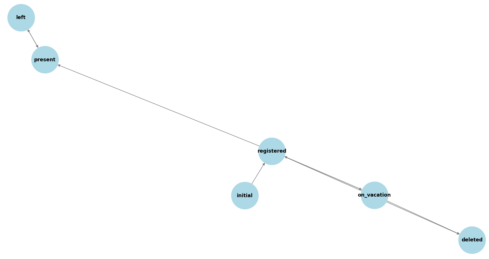

# Система учета посещаемости сотрудников с использованием бота

## Первичное включение

При первом включении бота доступна одна кнопка: **[Зарегистрироваться]**. Пользователь вводит имя и фамилию сообщением, после чего человек добавляется в базу данных (БД).

## Доступные действия после регистрации

После регистрации пользователю будут доступны три кнопки:

1. **[Пришел]**
2. **[У меня отпуск]**
3. **[Удалить аккаунт]**

### Кнопка [Пришел]

При нажатии на кнопку **[Пришел]** возможны два сценария:
1. Время прихода пользователя записывается в БД на сегодняшний день (предпочтительный подход).
2. Бот отправляет Антонине сообщение формата: `<Фамилия Имя> <пришел|ушел> <время>`.

**Уведомления:**
- Всем зарегистрированным пользователям будет приходить рассылка, начиная с 8:30 утра: «Не забудь отметиться, что ты пришел». Такие уведомления будут повторяться каждый час или полчаса до тех пор, пока пользователь не нажмет **[Пришел]**.
- После нажатия кнопки **[Пришел]** она заменяется на кнопку **[Ухожу]**.

**Кнопка [Ухожу]:**
1. Подтверждение действия: при нажатии на кнопку пользователя спрашивают: «Точно уходите?» с вариантами ответа Да/Нет, чтобы избежать нежелательных ситуаций (аналогично можно сделать для кнопки прихода).
2. Кнопка **[Пришел]** не появляется до следующего дня, так как предполагается, что после прихода и ухода рабочий день завершен.

**Кнопка отмены:**
- Можно предусмотреть кнопку отмены, которая будет отменять действия **[Пришел]** или **[Ушел]** в случае случайного нажатия.

### Кнопка [У меня отпуск]

При нажатии кнопки **[У меня отпуск]** предусмотрены два варианта:

1. Бот отменяет все уведомления и убирает все кнопки, кроме **[Отпуск закончился]** и **[Удалить аккаунт]**. Пока пользователь не закончит отпуск, бот не будет ничего присылать. Чтобы пользователь не забыл про бота, на 15 или 16 день с момента начала отпуска бот присылает напоминание о необходимости завершить отпуск. Либо бот предлагает ввести количество дней отпуска, и по истечении этого срока присылает напоминание.

2. Пользователь четко указывает даты отпуска в формате: 19.07.2024-26.07.2024. Бот выполняет те же действия, что и в первом варианте.

### Кнопка [Удалить аккаунт]

При нажатии на кнопку **[Удалить аккаунт]** пользователь удаляется из базы данных.

## Возможные проблемы и узкие места

### Регистрация и идентификация пользователей

**Проблема:** Возможны ошибки при вводе имени и фамилии, например, дублирование имен или опечатки.

**Решение:** Ввести валидацию на уникальность имени и фамилии при регистрации. Добавить поле "email" или "номер телефона" для уникальной идентификации. Но это (требование уникальности) накладывает доп. задачу изменения телефона. Соответственно, у человека должна быть возможность изменять свой телефон (отправлять запрос в БД через бота например отдельной кнопкой **[Изменить номер телефона]**).  

### Запись времени посещений

**Проблема:** Пользователь может злоупотреблять кнопками **[Пришел]** и **[Ушел]**, нажимая их несколько раз в день. Но все-таки иногда бывают случаи, когда человек может прийти сначала утром, потом уйти ближе к обеду, затем снова прийти и уйти. Следовательно, для такого случая будет 2 времени (возможно даже 3 и более), например: 8:30-11:40; 13:35-17:40. 

**Решение:** Ограничить возможность нажатия кнопок в течение одного дня. Например, после нажатия **[Пришел]** можно нажать только **[Ухожу]** и наоборот. И также, понадобиться пересмотреть логику кнопок **[Пришел]** и **[Ушел]**, т.е. чтобы можно было несколько раз нажимать их в 1 день.

### Напоминания

**Проблема:** Напоминания могут раздражать пользователей или приходить некорректно.

**Решение:** Дать пользователю возможность настроить частоту напоминаний (каждые 30 минут, каждый час и т.д.). Проверять, не включен ли режим отпуска перед отправкой напоминания.

### Обработка отпусков

**Проблема:** Пользователь может забыть выключить режим отпуска.

**Решение:** Добавить возможность указания конкретного количества дней отпуска или даты окончания. Отправлять напоминание за день до окончания отпуска.

### Отмена действий

**Проблема:** Случайное нажатие кнопок **[Пришел]** или **[Ушел]**.

**Решение:** Добавить функцию подтверждения действия и возможность отмены в течение определенного времени (например, 5 минут).

### Удаление аккаунта

**Проблема:** Пользователь случайно удалит аккаунт.

**Решение:** Ввести подтверждение удаления аккаунта и предупредить о необратимости действия.

## Улучшения и дополнительные функции

### История действий

Ведение полной истории действий пользователя с возможностью просмотра позволит выявить любые подозрительные активности.

### Аналитика

Добавить возможность генерации отчетов по посещаемости сотрудников для менеджеров.

### Интеграция с календарем

Возможность интеграции с календарями (Google Calendar, Outlook) для автоматического учета дней отпуска и напоминаний.

### Различные роли пользователей

Разделение пользователей на обычных сотрудников и администраторов для возможности управления и мониторинга.

### Многофакторная аутентификация

Увеличение безопасности через использование многофакторной аутентификации при входе и подтверждении важных действий.

## Возможные сценарии обмана и защита от них

### Обман с временем прихода и ухода

**Решение:** Использовать геолокацию для подтверждения присутствия на рабочем месте. Ограничить количество возможных изменений статуса в день.

### Регистрация под чужим именем

**Решение:** Верифицировать регистрацию через email или номер телефона, возможно, с использованием одноразовых паролей (OTP).

### Неиспользование кнопки [Пришел]

**Решение:** Ввести строгий контроль через напоминания и уведомления руководителям при многократном игнорировании.

## Моделирование

### Требования

Для запуска скрипта по созданию конечного автомата на Python необходимо установить все зависимости из файла `requirements.txt`. Убедитесь, что у вас установлен Python. Выполните следующую команду для установки необходимых модулей:

```bash
pip install -r requirements.txt
```

### Запуск скрипта

После установки всех необходимых модулей, вы можете запустить скрипт finite_state_machine.py, чтобы создать и визуализировать конечный автомат:

```bash
python finite_state_machine.py
```

### Описание конечного автомата

Конечный автомат (FSM) моделирует систему учета посещаемости сотрудников. Он состоит из следующих состояний и переходов:

**initial**: начальное состояние, в котором бот ожидает регистрации.
**registered**: состояние, в котором пользователь зарегистрирован и имеет доступ к основным функциям.
**present**: состояние, в котором пользователь отметился, что пришел.
**left**: состояние, в котором пользователь отметился, что ушел.
**on_vacation**: состояние, в котором пользователь находится в отпуске.
**deleted**: аккаунт удален.

#### Переходы:

| Переход                        | Откуда                    | Куда        | Описание                                               |
| ------------------------------ | ------------------------- | ----------- | ------------------------------------------------------ |
| **register**                   | initial                   | registered  | Пользователь регистрируется в системе                  |
| **check_in**                   | registered                | present     | Пользователь отмечает приход                           |
| **check_out**                  | present                   | left        | Пользователь отмечает уход                             |
| **check_in_again**             | left                      | present     | Пользователь повторно отмечает приход                  |
| **check_out_again**            | present                   | left        | Пользователь повторно отмечает уход                    |
| **go_on_vacation**             | registered                | on_vacation | Пользователь уходит в отпуск                           |
| **delete_account**             | registered, present, left | deleted     | Удаление аккаунта                                      |
| **end_vacation**               | on_vacation               | registered  | Пользователь возвращается из отпуска                   |
| **delete_account_on_vacation** | on_vacation               | deleted     | Удаление аккаунта пользователя, находящегося в отпуске |



## Применение методов моделирования для оценки системы

### Метод Монте-Карло

Метод основывается на использовании случайных выборок и статистического анализа для оценки характеристик системы или процесса. В контексте моделирования конечного автомата для системы учета посещаемости, применение метода Монте-Карло позволяет получить представление о распределении состояний и действий пользователей на основе большого числа случайных симуляций. Такой подход обеспечивает более глубокое понимание динамики системы и позволяет выявить возможные узкие места или аномалии, которые могут быть неочевидны при детерминированном анализе.

#### Полученные результаты

**Количество и Процентное Соотношение Состояний**

| State       | Count | Percentage |
| ----------- | ----- | ---------- |
| initial     | 1     | 14.29%     |
| registered  | 2     | 28.57%     |
| present     | 0     | 0.00%      |
| left        | 0     | 0.00%      |
| on_vacation | 2     | 28.57%     |
| deleted     | 2     | 28.57%     |

Из таблицы видно, что наибольшее количество состояний пришлось на "registered", "on_vacation" и "deleted", все они составили 28.57% от общего числа состояний. Это указывает на то, что пользователи часто регистрируются, отправляются в отпуск или удаляются. Небольшой процент состояний "initial" (14.29%) может свидетельствовать о том, что начальное состояние быстро изменяется на "registered". Полное отсутствие состояний "present" и "left" может говорить о том, что пользователи редко находятся в этих состояниях или быстро покидают их.

**Количество и Процентное Соотношение Действий Пользователей**

| Action                     | Count | Percentage |
| -------------------------- | ----- | ---------- |
| register                   | 125   | 12.50%     |
| check_in                   | 122   | 12.20%     |
| go_on_vacation             | 107   | 10.70%     |
| delete_account             | 117   | 11.70%     |
| check_out                  | 120   | 12.00%     |
| check_in_again             | 160   | 16.00%     |
| end_vacation               | 118   | 11.80%     |
| delete_account_on_vacation | 131   | 13.10%     |

В отношении действий пользователей, наибольшее количество действий пришло на "check_in_again" (16.00%), что говорит о частых возвратах пользователей после предыдущего выхода. Остальные действия распределены более равномерно, с небольшим перевесом в сторону "register", "check_in", "check_out", и "delete_account_on_vacation". Это указывает на активное взаимодействие пользователей с системой в различных аспектах, включая регистрацию, вход, выход и удаление.
